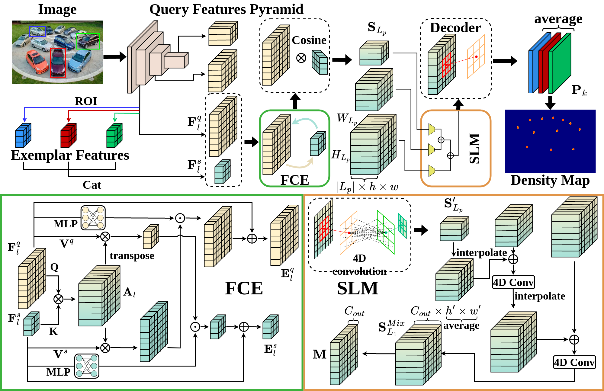

# SSD: Learning Spatial Similarity Distribution for Few-shot Object Counting

[[Homepage](https://github.com/CBalance/SSD)][[paper](https://www.ijcai.org/proceedings/2024/167)]

official code for ijcai24 "Learning Spatial Similarity Distribution for Few-shot Object Counting"



# Requirement
The following python packages are required:
```
pytorch == 1.9.0
torchvision == 0.10.0
mmcv == 1.3.13
timm == 0.4.12
termcolor
yacs
einops
```

# Data Preparation

- Download [FSC-147](https://github.com/cvlab-stonybrook/LearningToCountEverything)
- modify the `root` in line 12 of `datasets/gendata384x576.py` to the local path of FSC-147.
- running the file `datasets/gendata384x576.py`

# Training

- modify the `datapath` in `run.sh` to the local path of FSC-147 dataset
- using your own environment: `./run.sh`


# Citation
@inproceedings{xu2024learning,

  title={Learning Spatial Similarity Distribution for Few-shot Object Counting},
  
  author={Xu, Yuanwu and Song, Feifan and Zhang, Haofeng},
  
  booktitle={Proceedings of the Thirty-Third International Joint Conference on Artificial Intelligence},
  
  pages={1507-1515},
  
  year={2024}
}


